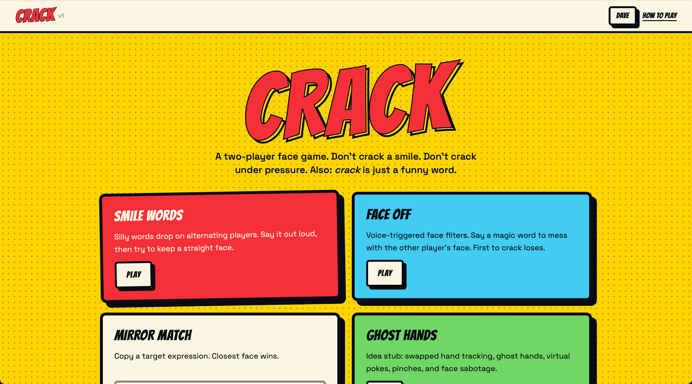
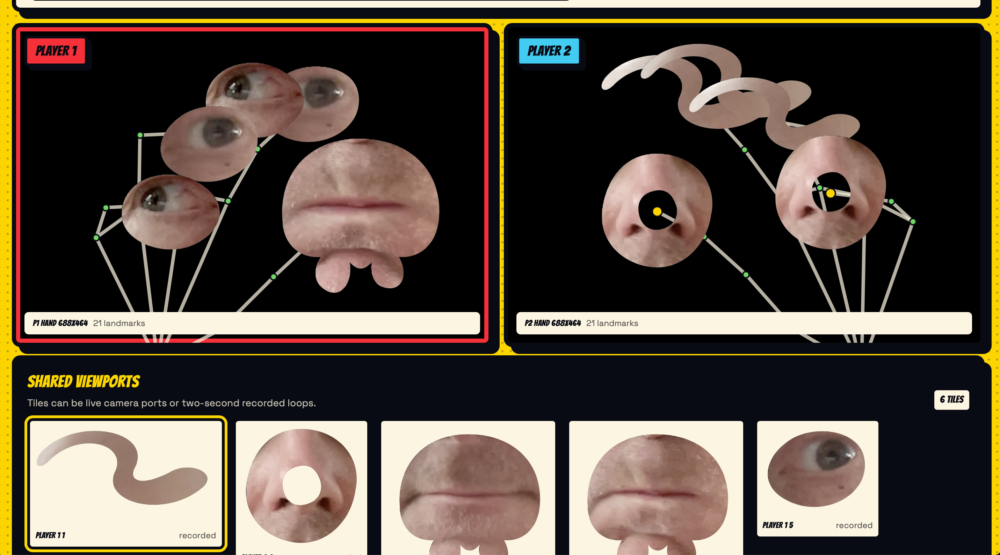

CRACK! is a suite of browser-based games that emphasize silliness, laughter, and creative use of technology.

## ThingamaPuppet

Players sample various parts of themselves, for example their eye, either recorded or real-time, and assemble these pieces into a puppet that they can control with their hand.

The goal of this game is simply to have fun creating something bizarre.

