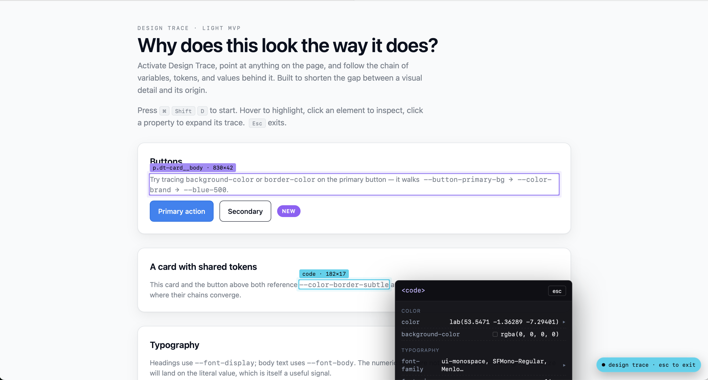

design-trace is a tool that does more than expose the design attributes of a web element. It also helps us understand the *why*.

## What it does

Like many existing tools, this accesses attributes through the DOM.
In addition, integration with source code analysis allows the user to see the logical pathway that determines the current state.

This is an invaluable tool in navigating a complex design construction.

