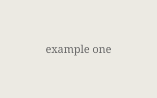

A longer description for Example One. This page is sourced from
`public/projects/example-one/index.md` and rendered as Markdown at runtime.

## What it does
Replace this text with a real writeup. Images can live next to this file
and be referenced with relative paths, e.g. ``.

