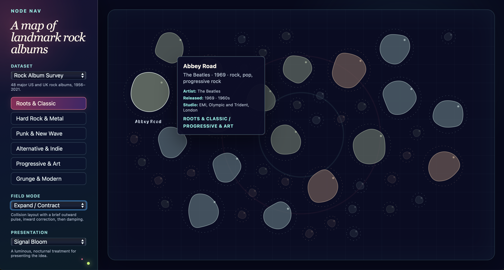

`node-nav` is an experiment in navigating collections as spatial, semantic
fields rather than menus, grids, or rigid hierarchies.

## What it does

Items appear as nodes in a dynamic field. Selecting a facet changes their
prominence and allows relationships to emerge through overlap: a project can
be about sound, code, and participation at the same time instead of being
filed into a single category.

The current prototype uses a lightweight force-directed layout and supports
multiple datasets. One represents an independent creative practice; another
maps 48 major rock albums through overlapping genre families. Switching
between them helps test whether the navigation model remains useful across
collections with different sizes, subjects, and densities.

The project is intentionally more concerned with structure and interaction
than finished visual styling. A presentation switch makes that distinction
visible: the same field can be viewed as a bare structural prototype or with a
more expressive visual treatment.

## Focus areas

- Exploratory navigation without a fixed hierarchy
- Items that belong to several categories at once
- Layout behavior as a form of information design
- Separating data, layout, interaction, and visual presentation
- Progressive detail through filtering and hover

