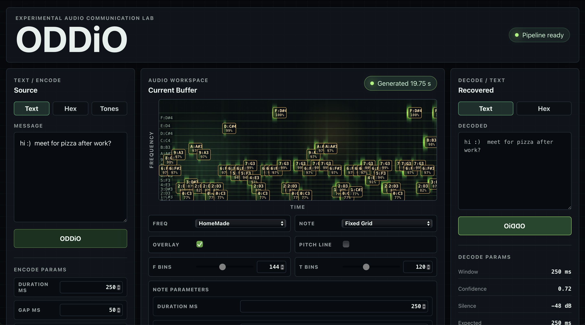

ODDiO is your sonic secret decoder ring.

It's a browser-based experimental audio communication lab. It explores how
short text messages can be encoded as audible tones, played through ordinary
speakers, and decoded again through a microphone.

## What it does

ODDiO converts text into UTF-8 bytes, maps those bytes to a sequence of musical
pitches, and synthesizes the result with the Web Audio API. On the receiving
side, it analyzes recorded or live audio, identifies the transmitted pitches,
and reconstructs the original message.

The interface is designed as a signal-analysis workbench rather than a
traditional messaging app. Waveform, spectrogram, detected-note, and decoded
symbol views make the protocol visible and turn each transmission into
something that can be inspected, understood, and experimented with.

## Focus areas

- Encoding text as deterministic sequences of audible tones
- Browser-native sound synthesis and microphone analysis
- Pitch detection, timing, and confidence visualization
- Exploring playful communication through sound

