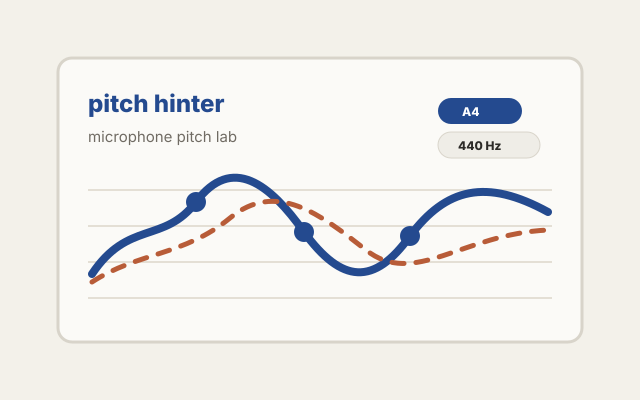

Pitch Hinter is a browser-based experiment for exploring real-time pitch
detection from microphone input.

## What it does

The project started as a small pitch lab: a place to compare pitch detection
algorithms, inspect confidence values, and understand how raw microphone input
turns into musical pitch data. The first implemented detector uses
Pitchy / McLeod, with additional autocorrelation and YIN-style experiments
giving the interface room to become a more complete comparison tool.

Beyond pitch extraction, the interesting part is the feedback layer. Pitch
Hinter includes filter-chain ideas like confidence gates, median filtering,
EMA smoothing, hold-last behavior, and jump limiting. Those tools make it
possible to study the messy design space between signal processing and a
musical interface that feels readable to a human.

## Focus areas

- Real-time microphone input in the browser
- Pitch detection and confidence visualization
- Comparing raw detector output with filtered pitch traces
- Musical-interface design for noisy, continuous input

