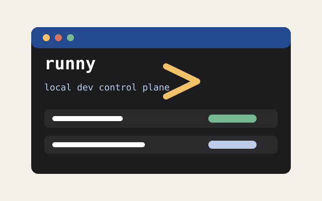

Runny is a lightweight local development orchestrator for personal projects.
It is meant to make starting, observing, and cleaning up local dev servers feel
less scattered.

## What it does

Instead of manually juggling commands, ports, browser windows, and lingering
processes across projects, Runny acts as a small developer control plane. From
inside a project directory, it can launch the development server, observe the
actual port that opens, keep track of running processes, and surface the state
of local projects in a live terminal interface.

The goal is not to become a heavy production orchestration system. Runny is
intended to feel ambient and pleasant: enough structure to reduce terminal
clutter and PID hunting, but light enough to stay out of the way.

## Focus areas

- Local dev-server launching and process tracking
- Port visibility, especially for Vite and other common frontend tools
- Cleanup workflows for stale or confusing local servers
- A small TUI dashboard for project status

