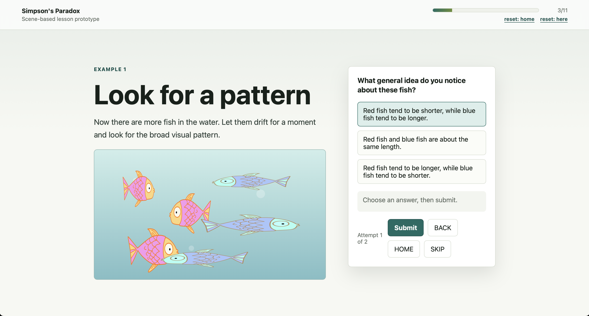
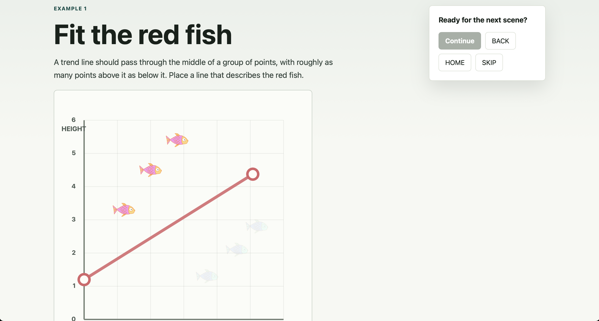
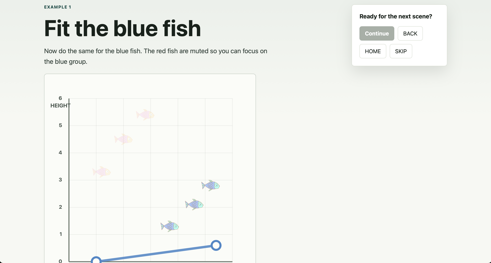

`simpsons-paradox` is an interactive lesson about Simpson's Paradox.

It contains a sequence of examples that highlight different ways this paradox can appear.
It uses different contexts and varying modes of interaction.

