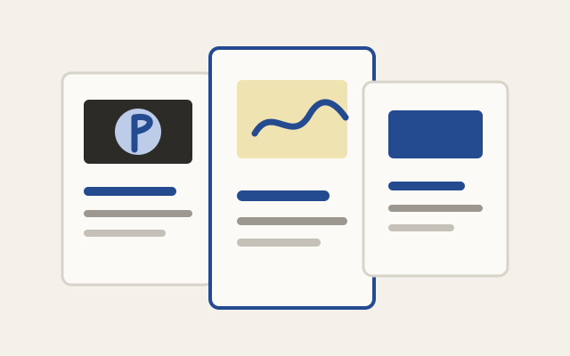

This project groups a few small website builds that share a similar design
problem: make a focused public home for real people, performances, or local
organizations without turning the site into a loud marketing machine.

## Personal portfolio

This site is part of the same body of work. It is a lightweight static portfolio
designed around clear writing, restrained visual identity, project cards, and
GitHub Pages deployment. The homepage has to hold educational software,
scientific research, music-adjacent experiments, developer tools, and small
website builds without letting any one category dominate the whole identity.

## Professional musician site

The lead example is a simple, tasteful site for a professional folk/acoustic
musician: voice, guitar, and acoustic performance. The content centers selected
recordings, performance history, upcoming dates, and booking contact, with copy
like "a grounded acoustic presence" and "solo guitar, voice, and intimate
acoustic settings." The design goal is warm, grounded, mature, and
music-centered without clutter or aggressive promotion.

## Gordon Lightfoot Project

The Gordon Lightfoot Project site has a related challenge: present a group of
musicians performing songs they love while avoiding the feeling of a flashy
tribute act or nostalgia product. The site direction emphasizes live
performance, ensemble identity, strong photography, and a calm sense of musical
craft. The central line of the project is a tribute to the writing, not an
imitation of the man.

## Zach Cowan educator and percussionist site

This one-page site positions Zach Cowan as both an independent math educator and
a deeply trained percussionist. The design direction is calm, grounded, and
high-trust: clear math support, rhythm instruction, contact pathways, and enough
warmth to feel human without drifting into hype. The core promise is clear,
confidence-building math support in Chico and online, alongside hand drum and
drum kit instruction rooted in African and Afro-diasporic traditions.

## RKDC

The RKDC work belongs in the same family of small, identity-sensitive websites:
clear structure, careful visual tone, and enough polish to feel public without
overbuilding the technology. The site presents Rachel D.K. Clark as a
contemporary folk artist and educator whose wearable art, quilts, patterns, and
instructional work draw from family sewing traditions, vivid fabric
combinations, humor, and traditional quilt making.

## Why group these?

These sites are individually useful, but the more interesting portfolio story is
the pattern across them. They show lightweight frontend development, restrained
visual design, content organization, deployment judgment, and an ability to
match a site's interface to the emotional tone of the person or group it
represents.

