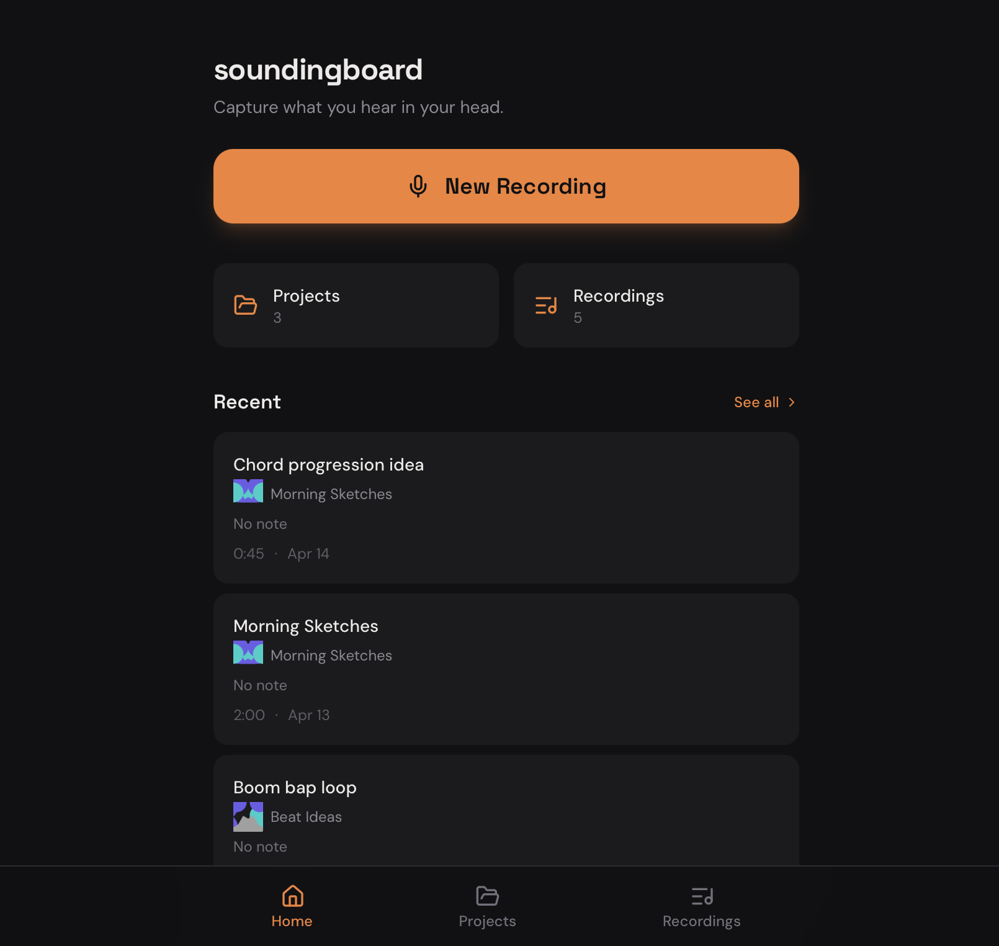

'soundingboard' is a tool for capturing, annotating, and organizing musical ideas.

## What it does

Problems:
- audio is hard to scan quickly. You can't easily scroll through a gallery and discover the clip you want.
- the good parts can be hidden. Often it's that 12th take that's the good one. Or you start with 10 minutes of noodling and then the magical part happens.
- context is important and is easily lost. Was this clip supposed to be a new bridge for that song I'm writing? 
- details are hard to reconstruct. This clip uses stacked major 7th chords in a quartal pattern. or. This was recorded with the Shure 58 in a shoebox for effect.

'soundingboard' seeks to address these issues by emphasizing the importance of context and priority.

